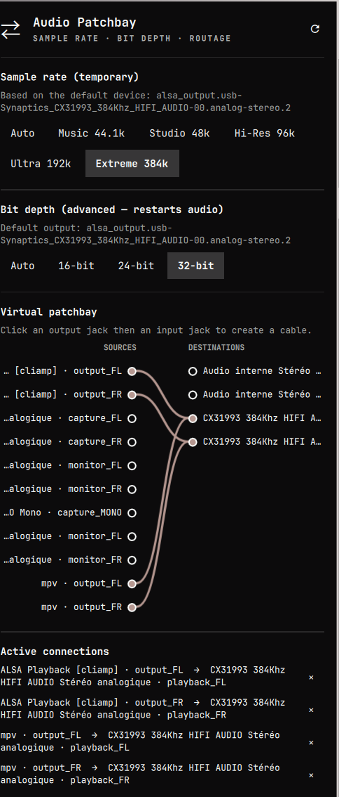

# Audio Patchbay

An [Omarchy](https://omarchy.org/) bar plugin for advanced PipeWire audio
management: sample-rate and bit-depth presets scoped to what your current
output device actually supports, plus a visual virtual patchbay for routing
audio ports.



## Features

- **Sample rate** — quick presets (Auto / Studio 48k / Hi-Res 96k / …),
  applied live via `pw-metadata` (`clock.force-rate` / `clock.force-quantum`).
  Reversible in one click on "Auto".
- **Bit depth** (advanced) — forces the ALSA output format (`S16LE` /
  `S24LE` / `S32LE`) for the current default sink via a dedicated WirePlumber
  rule, then restarts `wireplumber` to apply it. "Auto" removes the rule and
  restarts the service. Local ALSA outputs only (not Bluetooth).
- **Device-aware presets** — both lists are filtered live against the actual
  capabilities of your current default output device (read from PipeWire's
  `EnumFormat` params), so you're never offered a rate or bit depth your
  hardware can't do. The same check runs again server-side before applying,
  as a safety net.
- **Visual virtual patchbay** — every active audio port (sinks, sources, and
  per-app streams) is listed as a jack in two columns; connections are drawn
  as live bezier cables. Click an output jack then an input jack (in either
  order) to connect them via `pw-link`; the active-connections list below
  lets you cut any cable with one click.

## Install

```bash
omarchy plugin add https://github.com/devfrp/omarchy-audio-pro --enable
```

Click the ⇄ icon in the bar to open the panel.

## Dependencies

`pw-dump`, `pw-link`, `pw-metadata`, `pactl`, `systemctl --user` — all present
on a standard PipeWire/WirePlumber system (no extra packages needed).

## Controls

- **Sample rate / bit depth**: pick a preset, then confirm — both actions
  briefly interrupt system audio (a clock change, or a WirePlumber restart).
  Only presets your current default output supports are shown.
- **Patchbay**: click a source jack (left column), then a destination jack
  (right column) — or the reverse order — to connect them. Active cables are
  drawn between connected jacks; use the × next to an entry in "Active
  connections" to disconnect.
- Refresh with the ↻ button, or wait — the panel polls PipeWire every 5
  seconds while open.

## Files and permissions

- No packaged Omarchy files are ever touched.
- Writes only
  `~/.config/wireplumber/wireplumber.conf.d/70-audio-patchbay-bitdepth.conf`,
  marked as owned by this plugin; refuses to overwrite a file it doesn't own
  or a symlink.
- Never uses `sudo`.

## Development

```bash
python3 patchbay.py json             # full snapshot (graph + status + capabilities)
python3 patchbay.py connect OUT IN   # connect two ports by id
python3 patchbay.py disconnect LINK  # cut a connection by link id
python3 patchbay.py rate PRESET      # auto|music|studio|hires88|hires|ultra176|ultra|extreme352|extreme|max705|max
python3 patchbay.py bitdepth PRESET  # auto|16|24|32
omarchy plugin validate .
```

The development installer (`install.sh`) symlinks the checkout into the user
plugin directory, backs up `shell.json`, and enables the widget. Keep the
checkout in place while installed. Use `uninstall.sh` to remove that symlink;
the source and any saved audio overrides are preserved.

If the shell keeps stale QML after an update, run `omarchy restart shell`.

## License

[MIT](LICENSE)
